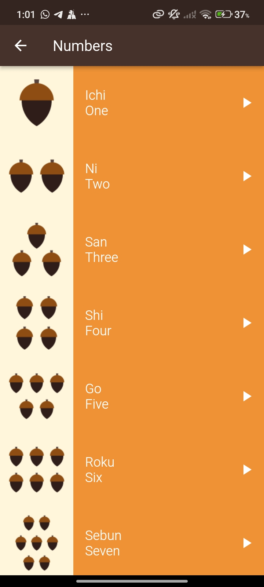
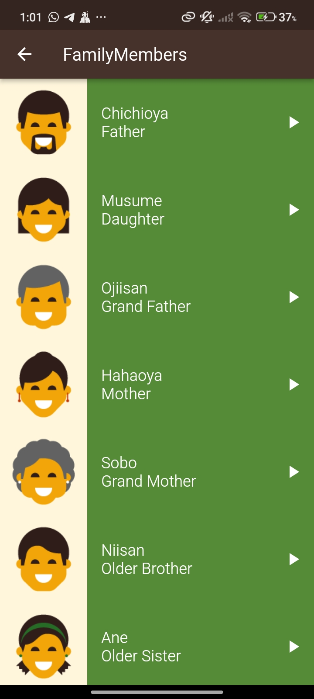
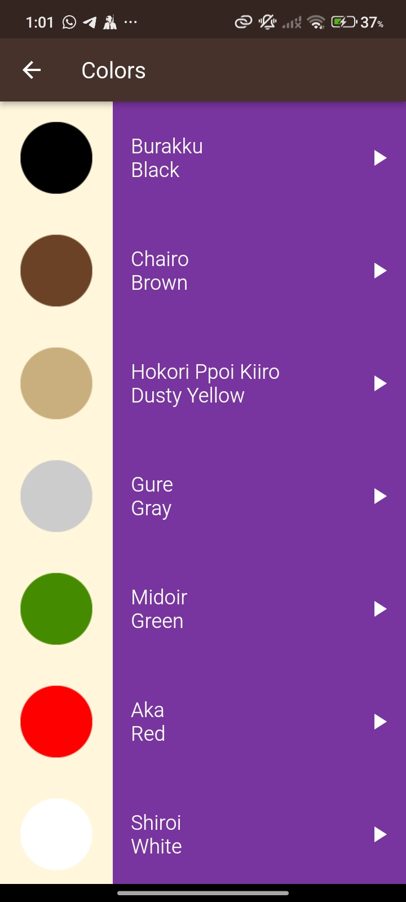
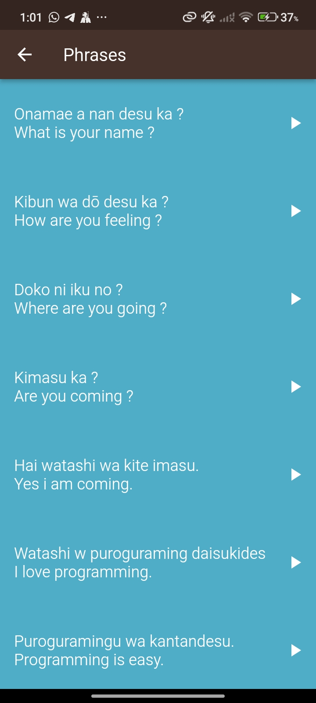

# Toku App

### A small and simple app to only practice on different types of assets

🎯 A Flutter application developed to explore and demonstrate handling multiple types of assets, with a special focus on integrating audio playback.
along with displaying local images and text content across multiple pages.

#### 🖼️ Screenshots

  
  
  
  

